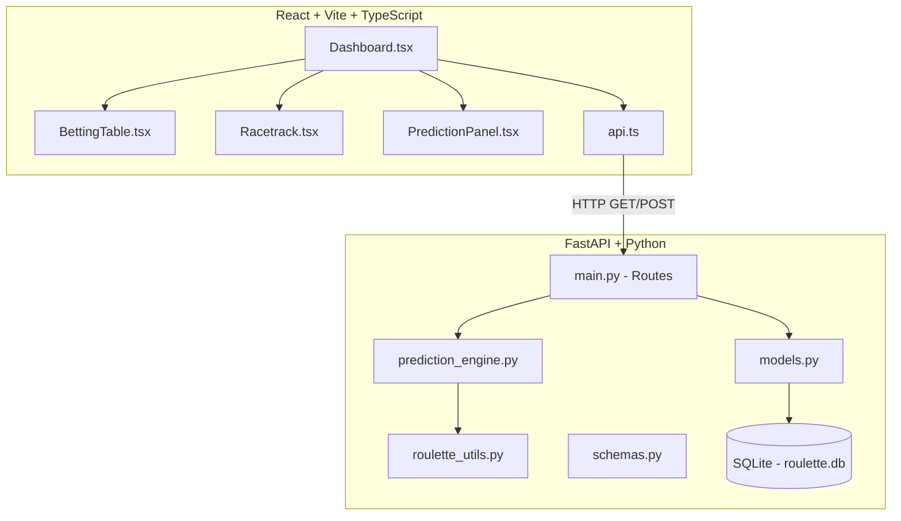
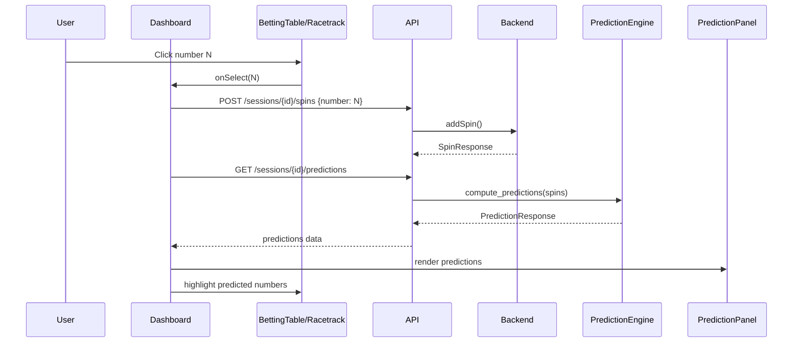

# Design Document: Realistic Roulette Board

## Overview

This feature replaces the existing simplified `RouletteBoard` component with a full casino-grade interface consisting of three tightly integrated components:

1. **BettingTable** — A CSS Grid layout replicating a real European roulette table (3×12 number grid, zero spanning full height, outside bets, column bets)
2. **Racetrack** — A pure SVG oval displaying all 37 numbers in European wheel order with traditional sector markings (Voisins, Tiers, Orphelins)
3. **PredictionEngine** (backend) + **PredictionPanel** (frontend) — A heuristic-based prediction system that analyzes spin history and surfaces the top-N most likely numbers with confidence scores and reasoning labels

The system maintains the existing architecture: React + Vite + TypeScript frontend communicating with a FastAPI + SQLAlchemy backend via REST. The prediction logic runs server-side and is exposed through a new GET endpoint. No new external dependencies are introduced.

## Architecture



### Data Flow



## Components and Interfaces

### Frontend Components

#### BettingTable

```typescript
interface BettingTableProps {
  onSelect: (number: number) => void;
  disabled: boolean;
  lastNumber: number | null;
  predictedNumbers: number[];
}

// Component: BettingTable.tsx
// Renders a CSS Grid layout with:
//   - Zero cell (row-span 3, left of grid)
//   - 3×12 number grid
//   - Dozen bets row (1st 12, 2nd 12, 3rd 12)
//   - Even-money bets row (1-18, EVEN, RED, BLACK, ODD, 19-36)
//   - Column bets column (three 2:1 cells, right of grid)
```

#### Racetrack

```typescript
interface RacetrackProps {
  onSelect: (number: number) => void;
  disabled: boolean;
  lastNumber: number | null;
  predictedNumbers: number[];
}

// Component: Racetrack.tsx
// Renders an SVG oval with:
//   - 37 arc segments in European wheel order
//   - Sector labels (Voisins, Tiers, Orphelins) outside the oval
//   - Color-coded segments (red/black/green)
//   - Click handlers on each segment
```

#### PredictionPanel

```typescript
interface Prediction {
  number: number;
  color: string;
  confidence_score: number;
  reasons: string[];
}

interface PredictionPanelProps {
  predictions: Prediction[];
  totalSpins: number;
  minSpinsRequired: number;
  loading: boolean;
}

// Component: PredictionPanel.tsx
// Renders:
//   - Colored circles for each predicted number
//   - Confidence percentage below each number
//   - Reasoning icons (🔥 frequency, 🎯 sector, 👥 neighbor, 📈 trend)
//   - "Minimum spins" message when insufficient data
```

#### Updated Dashboard

```typescript
// Dashboard.tsx modifications:
// - Replaces RouletteBoard with BettingTable + Racetrack
// - Adds PredictionPanel component
// - Fetches predictions after each spin
// - Passes lastNumber and predictedNumbers to BettingTable/Racetrack
```

#### API Client Extension

```typescript
// api.ts additions:

export interface Prediction {
  number: number;
  color: string;
  confidence_score: number;
  reasons: string[];
}

export interface PredictionResponse {
  predictions: Prediction[];
  analysis_window: number;
  min_spins_required: number;
  total_spins: number;
}

export const getPredictions = (sessionId: number) =>
  api.get<PredictionResponse>(`/sessions/${sessionId}/predictions`);
```

### Backend Components

#### Prediction Engine Module

```python
# backend/app/prediction_engine.py

EUROPEAN_WHEEL_ORDER: list[int] = [
    0, 32, 15, 19, 4, 21, 2, 25, 17, 34, 6, 27, 13, 36, 11,
    30, 8, 23, 10, 5, 24, 16, 33, 1, 20, 14, 31, 9, 22, 18,
    29, 7, 28, 12, 35, 3, 26
]

HEURISTIC_WEIGHTS: dict[str, float] = {
    "frequency": 0.30,
    "sector": 0.25,
    "neighbor": 0.25,
    "trend": 0.20,
}

MIN_SPINS_REQUIRED: int = 10

def compute_predictions(spins: list[Spin]) -> PredictionResponse:
    """Main entry point. Returns predictions or empty list if < 10 spins."""
    ...

def frequency_analysis(spins: list[Spin]) -> dict[int, float]:
    """Exponential decay weighted frequency. Returns score per number."""
    ...

def sector_analysis(spins: list[Spin]) -> dict[int, float]:
    """Detects hot sectors on the wheel. Returns score per number."""
    ...

def neighbor_analysis(spins: list[Spin]) -> dict[int, float]:
    """Scores neighbors (±2) of the last spin. Returns score per number."""
    ...

def trend_analysis(spins: list[Spin]) -> dict[int, float]:
    """Detects color/parity/dozen patterns in last 20 spins. Returns score per number."""
    ...

def combine_scores(
    freq: dict[int, float],
    sector: dict[int, float],
    neighbor: dict[int, float],
    trend: dict[int, float],
) -> list[Prediction]:
    """Weighted combination, normalization, and top-N selection."""
    ...
```

#### Prediction API Route

```python
# Added to main.py

@app.get("/api/sessions/{session_id}/predictions", response_model=PredictionResponse)
def get_predictions(session_id: int, db: DBSession = Depends(get_db)):
    """Returns predictions for a session based on spin history."""
    ...
```

#### Prediction Schemas

```python
# Added to schemas.py

class PredictionItem(BaseModel):
    number: int
    color: str
    confidence_score: float = Field(ge=0.0, le=1.0)
    reasons: list[str]

class PredictionResponse(BaseModel):
    predictions: list[PredictionItem]
    analysis_window: int
    min_spins_required: int = 10
    total_spins: int
```

## Data Models

### Existing Models (unchanged)

| Model   | Fields                                          |
|---------|-------------------------------------------------|
| Session | id, name, casino, created_at, spins (relation)  |
| Spin    | id, session_id, number, color, created_at        |

### New Schemas

#### PredictionItem

| Field            | Type       | Constraints       | Description                                    |
|------------------|------------|-------------------|------------------------------------------------|
| number           | int        | 0-36              | Predicted roulette number                      |
| color            | str        | red/black/green   | Color of the predicted number                  |
| confidence_score | float      | 0.0 - 1.0        | Relative confidence of prediction              |
| reasons          | list[str]  | non-empty         | Heuristic labels that contributed to this pick |

#### PredictionResponse

| Field              | Type               | Description                              |
|--------------------|--------------------|------------------------------------------|
| predictions        | list[PredictionItem] | Ranked predictions (descending confidence) |
| analysis_window    | int                | Number of spins analyzed                 |
| min_spins_required | int                | Always 10                                |
| total_spins        | int                | Total spins in session                   |

### Frontend Constants

```typescript
// constants.ts

export const EUROPEAN_WHEEL_ORDER = [
  0, 32, 15, 19, 4, 21, 2, 25, 17, 34, 6, 27, 13, 36, 11,
  30, 8, 23, 10, 5, 24, 16, 33, 1, 20, 14, 31, 9, 22, 18,
  29, 7, 28, 12, 35, 3, 26
];

export const SECTORS = {
  voisins: [22, 18, 29, 7, 28, 12, 35, 3, 26, 0, 32, 15, 19, 4, 21, 2, 25],
  tiers: [27, 13, 36, 11, 30, 8, 23, 10, 5, 24, 16, 33],
  orphelins: [17, 34, 6, 1, 20, 14, 31, 9],
};

export const RED_NUMBERS = new Set([1,3,5,7,9,12,14,16,18,19,21,23,25,27,30,32,34,36]);

export const BETTING_TABLE_ROWS = [
  [3, 6, 9, 12, 15, 18, 21, 24, 27, 30, 33, 36],  // row 1 (top)
  [2, 5, 8, 11, 14, 17, 20, 23, 26, 29, 32, 35],  // row 2 (middle)
  [1, 4, 7, 10, 13, 16, 19, 22, 25, 28, 31, 34],  // row 3 (bottom)
];

export const COLORS = {
  tableBackground: '#16213e',
  cellBorder: '#0f3460',
  red: '#c0392b',
  black: '#2c3e50',
  green: '#27ae60',
  gold: '#ffd700',
  accent: '#e94560',
};
```

## Low-Level Design

### Prediction Engine Algorithms

#### Frequency Analysis (weight: 30%)

```python
def frequency_analysis(spins: list[Spin]) -> dict[int, float]:
    """
    Applies exponential decay weighting to spin history.
    More recent spins contribute more to the frequency score.
    
    Algorithm:
    1. For each spin at index i (0 = oldest, n-1 = newest):
       weight_i = decay_factor ^ (n - 1 - i)
       where decay_factor = 0.95
    2. Accumulate weighted counts per number
    3. Normalize scores to [0, 1] range
    
    Pseudocode:
      scores = {n: 0.0 for n in range(37)}
      decay = 0.95
      n = len(spins)
      for i, spin in enumerate(spins):
          weight = decay ** (n - 1 - i)
          scores[spin.number] += weight
      max_score = max(scores.values()) or 1.0
      return {k: v / max_score for k, v in scores.items()}
    """
```

#### Sector Analysis (weight: 25%)

```python
def sector_analysis(spins: list[Spin]) -> dict[int, float]:
    """
    Detects sectors with above-average hit concentration.
    
    Algorithm:
    1. Divide wheel into 6 overlapping sectors of ~6 consecutive numbers each
       (using EUROPEAN_WHEEL_ORDER sliced into windows)
    2. Count hits per sector in the analysis window
    3. Identify sectors with hit_count > expected (total_hits / num_sectors)
    4. Score numbers in hot sectors proportionally to sector excess
    5. Normalize to [0, 1]
    
    Pseudocode:
      sector_size = 6
      sectors = [WHEEL[i:i+sector_size] for i in range(0, 37, sector_size)]
      expected = len(spins) / len(sectors)
      sector_hits = {i: count_hits(sector, spins) for i, sector in enumerate(sectors)}
      scores = {n: 0.0 for n in range(37)}
      for i, sector in enumerate(sectors):
          if sector_hits[i] > expected:
              excess = (sector_hits[i] - expected) / expected
              for num in sector:
                  scores[num] = excess
      normalize(scores)
      return scores
    """
```

#### Neighbor Analysis (weight: 25%)

```python
def neighbor_analysis(spins: list[Spin]) -> dict[int, float]:
    """
    Scores the ±2 physical neighbors of the last spin result.
    
    Algorithm:
    1. Find the position of the last spin number in EUROPEAN_WHEEL_ORDER
    2. Get the 2 numbers to the left and 2 to the right (wrapping around)
    3. Assign scores: immediate neighbors = 1.0, second neighbors = 0.5
    4. All other numbers = 0.0
    
    Pseudocode:
      last = spins[-1].number
      idx = WHEEL.index(last)
      scores = {n: 0.0 for n in range(37)}
      for offset in [-1, 1]:
          neighbor = WHEEL[(idx + offset) % 37]
          scores[neighbor] = 1.0
      for offset in [-2, 2]:
          neighbor = WHEEL[(idx + offset) % 37]
          scores[neighbor] = 0.5
      return scores
    """
```

#### Trend Analysis (weight: 20%)

```python
def trend_analysis(spins: list[Spin]) -> dict[int, float]:
    """
    Detects repeating patterns in color, parity, and dozen sequences.
    
    Algorithm:
    1. Take the last 20 spins (or all if fewer)
    2. Analyze color sequence: if last 3+ spins are same color,
       boost numbers of that color
    3. Analyze parity sequence: if last 3+ spins are same parity,
       boost numbers of that parity
    4. Analyze dozen sequence: if last 3+ spins are same dozen,
       boost numbers in that dozen
    5. Combine sub-scores with equal weight (1/3 each)
    6. Normalize to [0, 1]
    
    Pseudocode:
      window = spins[-20:]
      scores = {n: 0.0 for n in range(37)}
      
      # Color trend
      colors = [s.color for s in window if s.color != 'green']
      if len(colors) >= 3 and all(c == colors[-1] for c in colors[-3:]):
          hot_color = colors[-1]
          for n in numbers_of_color(hot_color):
              scores[n] += 0.33
      
      # Parity trend
      parities = ['even' if s.number % 2 == 0 else 'odd' for s in window if s.number != 0]
      if len(parities) >= 3 and all(p == parities[-1] for p in parities[-3:]):
          hot_parity = parities[-1]
          for n in numbers_of_parity(hot_parity):
              scores[n] += 0.33
      
      # Dozen trend
      dozens = [get_dozen(s.number) for s in window if s.number != 0]
      if len(dozens) >= 3 and all(d == dozens[-1] for d in dozens[-3:]):
          hot_dozen = dozens[-1]
          for n in numbers_of_dozen(hot_dozen):
              scores[n] += 0.33
      
      normalize(scores)
      return scores
    """
```

#### Score Combination

```python
def combine_scores(
    freq: dict[int, float],
    sector: dict[int, float],
    neighbor: dict[int, float],
    trend: dict[int, float],
) -> list[PredictionItem]:
    """
    Combines heuristic scores with configured weights and selects top predictions.
    
    Algorithm:
    1. For each number 0-36:
       combined[n] = freq[n]*0.30 + sector[n]*0.25 + neighbor[n]*0.25 + trend[n]*0.20
    2. Sort by combined score descending
    3. Take top 5 (or more if ties)
    4. Normalize top scores to [0, 1] confidence range
    5. Attach reasoning labels (include label if that heuristic's score > 0 for this number)
    6. Return as list of PredictionItem
    """
```

### Racetrack SVG Geometry

```typescript
// Racetrack arc segment calculation

function computeArcSegments(
  cx: number, cy: number,  // center of oval
  rx: number, ry: number,  // radii (horizontal, vertical)
  count: number            // 37 segments
): ArcSegment[] {
  // Each segment spans 360/37 ≈ 9.73 degrees
  const angleStep = (2 * Math.PI) / count;
  return EUROPEAN_WHEEL_ORDER.map((number, i) => {
    const startAngle = i * angleStep - Math.PI / 2; // start at top
    const endAngle = startAngle + angleStep;
    return {
      number,
      startAngle,
      endAngle,
      // SVG path: outer arc + inner arc (donut shape)
      path: describeArc(cx, cy, rx, ry, rx * 0.7, ry * 0.7, startAngle, endAngle),
      // Label position: midpoint of segment at middle radius
      labelX: cx + (rx * 0.85) * Math.cos((startAngle + endAngle) / 2),
      labelY: cy + (ry * 0.85) * Math.sin((startAngle + endAngle) / 2),
    };
  });
}

function describeArc(
  cx: number, cy: number,
  outerRx: number, outerRy: number,
  innerRx: number, innerRy: number,
  startAngle: number, endAngle: number
): string {
  // Returns SVG path "d" attribute for a donut segment
  // M outerStart A outerRx outerRy ... outerEnd
  // L innerEnd A innerRx innerRy ... innerStart Z
}
```

### BettingTable CSS Grid Layout

```
+------+----+----+----+----+----+----+----+----+----+----+----+----+------+
|      |  3 |  6 |  9 | 12 | 15 | 18 | 21 | 24 | 27 | 30 | 33 | 36 | 2:1  |
|  0   +----+----+----+----+----+----+----+----+----+----+----+----+------+
|      |  2 |  5 |  8 | 11 | 14 | 17 | 20 | 23 | 26 | 29 | 32 | 35 | 2:1  |
|      +----+----+----+----+----+----+----+----+----+----+----+----+------+
|      |  1 |  4 |  7 | 10 | 13 | 16 | 19 | 22 | 25 | 28 | 31 | 34 | 2:1  |
+------+----+----+----+----+----+----+----+----+----+----+----+----+------+
|      |       1st 12       |       2nd 12       |       3rd 12       |      |
+------+----+----+----+----+----+----+----+----+----+----+----+----+------+
|      | 1-18 | EVEN | RED  | BLACK | ODD  | 19-36 |                   |      |
+------+------+------+------+-------+------+-------+-------------------+------+

CSS Grid: grid-template-columns: 60px repeat(12, 1fr) 60px;
           grid-template-rows: repeat(3, 1fr) auto auto;
Zero cell: grid-row: 1 / 4; grid-column: 1;
Column bets: grid-column: 14; one per row
```

## Correctness Properties

*A property is a characteristic or behavior that should hold true across all valid executions of a system — essentially, a formal statement about what the system should do. Properties serve as the bridge between human-readable specifications and machine-verifiable correctness guarantees.*

### Property 1: Color mapping is exhaustive and correct

*For any* number in the range 0-36, the `getColor` function SHALL return exactly one of "red", "black", or "green", and the union of the red set, black set, and {0} SHALL equal the full set {0, 1, ..., 36} with no overlaps.

**Validates: Requirements 1.3, 4.3**

### Property 2: Click callback delivers correct number

*For any* number in the range 0-36 and any component (BettingTable or Racetrack) in enabled state, clicking the cell/segment for that number SHALL invoke the onSelect callback with exactly that number as the argument.

**Validates: Requirements 3.1, 6.1**

### Property 3: Disabled state prevents all interactions

*For any* number in the range 0-36 and any component (BettingTable or Racetrack) with disabled=true, clicking the cell/segment for that number SHALL NOT invoke the onSelect callback.

**Validates: Requirements 3.2, 6.2**

### Property 4: Last number receives gold highlight

*For any* number in the range 0-36 passed as `lastNumber`, the corresponding cell/segment SHALL have a gold border style applied, and no other cell/segment SHALL have that style.

**Validates: Requirements 3.3, 6.3**

### Property 5: Predicted numbers receive glow effect

*For any* non-empty subset of numbers from 0-36 passed as `predictedNumbers`, each corresponding cell/segment SHALL have the pulsing glow effect applied, and cells/segments not in the subset SHALL NOT have that effect.

**Validates: Requirements 3.4, 6.4**

### Property 6: Prediction output validity for sufficient spins

*For any* list of 10 or more valid spins (each with number in 0-36), `compute_predictions` SHALL return a result where: (a) the predictions list contains at least 5 items, (b) each item has a confidence_score in [0.0, 1.0], (c) each item has a non-empty reasons list with values only from {"frequency", "sector", "neighbor", "trend"}, and (d) the list is sorted by confidence_score in non-increasing order.

**Validates: Requirements 7.1, 7.3, 7.4, 7.5**

### Property 7: Empty predictions for insufficient spins

*For any* list of 0 to 9 valid spins (each with number in 0-36), `compute_predictions` SHALL return a result with an empty predictions list.

**Validates: Requirements 7.2**

### Property 8: Weighted combination correctness

*For any* four score dictionaries (one per heuristic) mapping numbers 0-36 to values in [0.0, 1.0], the `combine_scores` function SHALL produce a combined score for each number equal to `freq[n]*0.30 + sector[n]*0.25 + neighbor[n]*0.25 + trend[n]*0.20` (before normalization and selection).

**Validates: Requirements 8.1**

### Property 9: Frequency analysis decay monotonicity

*For any* spin history of length ≥ 2 where the same number appears at two different positions, the contribution of the more recent occurrence SHALL be strictly greater than the contribution of the older occurrence.

**Validates: Requirements 8.2**

### Property 10: Sector analysis hot sector detection

*For any* spin history of 10+ spins where all spins land within a single wheel sector, the numbers in that sector SHALL have higher sector_analysis scores than numbers in sectors with zero hits.

**Validates: Requirements 8.3**

### Property 11: Neighbor analysis identifies ±2 physical neighbors

*For any* number N in 0-36, when N is the last spin, `neighbor_analysis` SHALL assign non-zero scores to exactly the 4 numbers that are ±1 and ±2 positions from N in EUROPEAN_WHEEL_ORDER (wrapping around), and zero scores to all other numbers.

**Validates: Requirements 8.4**

### Property 12: Trend analysis detects color streaks

*For any* spin history where the last 3 or more non-zero spins share the same color, `trend_analysis` SHALL assign higher average scores to numbers of that color than to numbers of the other color.

**Validates: Requirements 8.5**

## Error Handling

### Backend Errors

| Scenario | HTTP Status | Response Body | Handling |
|----------|-------------|---------------|----------|
| Session not found | 404 | `{"detail": "Session not found"}` | Frontend shows error toast |
| Invalid session_id format | 422 | Pydantic validation error | Frontend shows generic error |
| Database connection failure | 500 | `{"detail": "Internal server error"}` | Frontend shows retry prompt |
| Prediction computation timeout | 500 | `{"detail": "Prediction timeout"}` | Frontend shows stale predictions with warning |

### Frontend Error States

| Component | Error Condition | Behavior |
|-----------|----------------|----------|
| PredictionPanel | API fetch fails | Show "Erro ao carregar previsões" with retry button |
| PredictionPanel | Loading state | Show skeleton/spinner in place of predictions |
| BettingTable | onSelect throws | Catch error, re-enable board, show error toast |
| Racetrack | SVG render error | Fallback to simple number list |
| Dashboard | Predictions stale | Show last known predictions with "updating..." indicator |

### Edge Cases

- **Zero spins**: PredictionPanel shows minimum spins message; BettingTable/Racetrack render normally with no highlights
- **Exactly 10 spins**: Predictions are computed (boundary condition)
- **All spins same number**: Frequency analysis dominates; predictions still return ≥5 numbers (other heuristics contribute variety)
- **Session with 1000+ spins**: Performance requirement (< 100ms); analysis window may be capped to last N spins for efficiency

## Testing Strategy

### Property-Based Tests (Backend - Python)

**Library**: [Hypothesis](https://hypothesis.readthedocs.io/) (already compatible with existing pytest setup)

**Note**: Hypothesis is a dev dependency only, used for testing. It does not violate Requirement 12 which constrains runtime dependencies.

**Configuration**: Minimum 100 examples per property test.

| Property | Test File | Description |
|----------|-----------|-------------|
| Property 1 | `test_roulette_utils.py` | Color mapping exhaustiveness |
| Property 6 | `test_prediction_engine.py` | Output validity for ≥10 spins |
| Property 7 | `test_prediction_engine.py` | Empty output for <10 spins |
| Property 8 | `test_prediction_engine.py` | Weighted combination correctness |
| Property 9 | `test_prediction_engine.py` | Decay monotonicity |
| Property 10 | `test_prediction_engine.py` | Hot sector detection |
| Property 11 | `test_prediction_engine.py` | Neighbor identification |
| Property 12 | `test_prediction_engine.py` | Color streak detection |

Each test tagged with: `# Feature: realistic-roulette-board, Property {N}: {title}`

### Property-Based Tests (Frontend - TypeScript)

**Library**: [fast-check](https://github.com/dubzzz/fast-check) (dev dependency only)

| Property | Test File | Description |
|----------|-----------|-------------|
| Property 1 | `BettingTable.test.tsx` | Color mapping (shared constants) |
| Property 2 | `BettingTable.test.tsx` | Click callback correctness |
| Property 3 | `BettingTable.test.tsx` | Disabled state |
| Property 4 | `BettingTable.test.tsx` | Last number highlight |
| Property 5 | `BettingTable.test.tsx` | Predicted numbers glow |

### Unit Tests (Example-Based)

| Test | Scope | What it verifies |
|------|-------|------------------|
| Grid layout constants | BettingTable | Rows match expected [3,6,9...], [2,5,8...], [1,4,7...] |
| Outside bet labels | BettingTable | Dozen and even-money labels render correctly |
| Wheel order constant | Racetrack | EUROPEAN_WHEEL_ORDER has 37 unique numbers |
| Sector membership | Racetrack | Voisins=17, Tiers=12, Orphelins=8 numbers |
| SVG segment count | Racetrack | Exactly 37 path elements rendered |
| Min spins message | PredictionPanel | Shows Portuguese message when < 10 spins |
| API 404 handling | Backend | Non-existent session returns 404 |
| Response schema | Backend | Prediction response has all required fields |

### Integration Tests

| Test | Scope | What it verifies |
|------|-------|------------------|
| Spin → Prediction refresh | Dashboard | Adding spin triggers prediction fetch |
| Performance benchmark | Backend | 1000 spins → response < 100ms |
| End-to-end prediction flow | Full stack | Record 15 spins, verify predictions appear in UI |

### Test Commands

```bash
# Backend (from backend/ directory)
pip install hypothesis pytest
pytest tests/ -v

# Frontend (from frontend/ directory)
npm install --save-dev vitest @testing-library/react fast-check jsdom @testing-library/jest-dom
npx vitest --run
```

